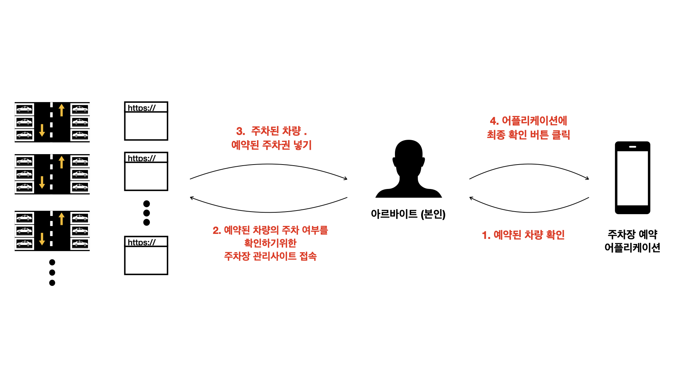
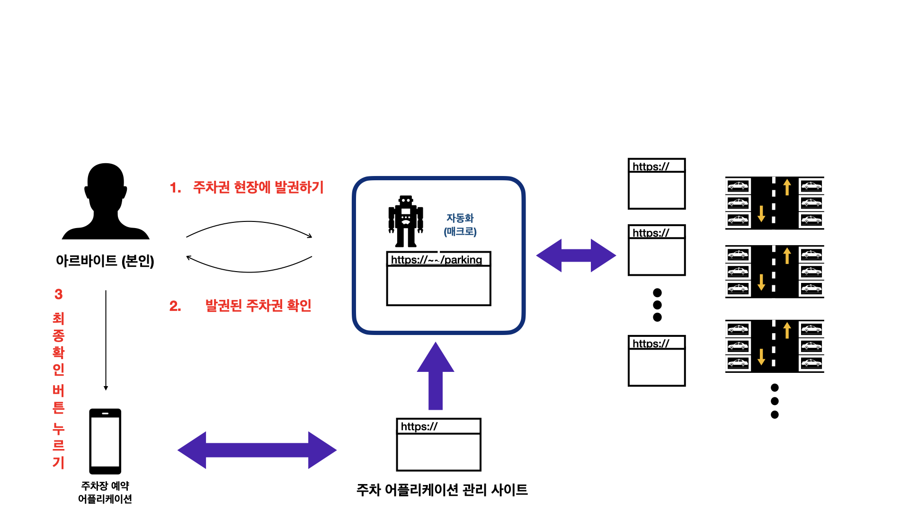

# webmacro

## 목표
주차권 발권 아르바이트에서 생긴 어려움을 소프트웨어 개발을 통해 해결한 경험이 있습니다. 결제된 주차권을 처리하는 일을 진행하면서 각 주차장에서 사용하는 주차장 관리 기계 회사가 다르기에 일일이 각 주차장 기계에 맞는 회사 사이트를 로그인하여 입차 차량을 대조해가며 업무 처리하는 방식이라 오랜 시간이 걸렸습니다. 그래서 각 주차장 관리 사이트에 자동으로 로그인하여 입차 차량 여부를 확인하고 입차 시 주차권을 발권하는 자동화 업무 기능을 가진 서버를 개발하고자 하였습니다. 해당 서버는 Spring boot으로 개발하였고 웹 테스트 프레임 워크인 Selenium을 사용하여 동적인 크롤링 방식을 이용해 자동화 기능을 구현하는 것이 목표입니다.
학
## before

이 사이트를 쓰기 전까지는 업무 순서는
  1. 직접 어플리케이션 앱에 모든 주차장의 주차권 예약 현황을 확인하고 
  2. 각 주차장에 해당하는 관리 사이트를 접속한다.
  3. 예약된 주차권의 차량이 입차되었는 지 확인하고 
  4. 만약 해당 차량이 입차되었다면 주차권 입력.

## After

만약 이 자동화 사이트를 이용한다면
  1. 자동화 사이트를 접속한다.
  2. 주차권 업데이트 버튼을 눌러 어플리케이션 앱의 주차권 예약 현황을 크롤링한다.
  3. 주차권 발권하기 버튼을 누르면 자동으로 해당 관리 사이트에 들어가서 발권한다. (Selenium 프레임워크 사용)

## 효과
이전의 150대의 예약된 주차권을 처리하기 위해서는 1시간이 걸렸지만 이 사이트를 이용하면서 15분이면 처리할 수 있었다.

## 메인 페이지

이 페이지 에서 차량, 주차권, 주차장 이름을 검색할 수 있다.

## 주요 기능
- 주차권 업데이트
- 주차권 발권하기
- 오류난 주차권 처리
- 차량, 주차권, 주차장 검색 기능

## 사용한 기술
- spring boot 2.4.4
- hibernate 5.3.11
- webdrivermanger 4.4.3 -> WebDriver를 자동 업데이트 하는 데 이용
- selenium 3.141.59 -> 동적 크롤링 목적
